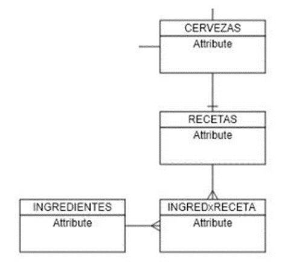

# guia5

1. Mostrar la información de todas las cervezas junto con el respectivo nombre de su receta segun corresponda.
2. listar 3 de las recetas que contengan mas de 5 ingredientes.
3. ordenar los ingredientes de cada receta junto con el nombre de cada ingrediente de forma descendente.
4. Consultar el Promedio de ingredientes de todas las recetas.
5. Listar toda la informacion de cada una de las recetas y toda la informacion de los ingredientes.
6. Listar las cervezas que se encuentren entre la letras C y P, junto al nombre de su receta.
7. Listar la Receta que mas ingredientes contenga.
8. Listar los 2 ingredientes que menos se utilizan (en menos recetas se encuentre).
9. Listar todos los Ingredientes que en Stock tengan mas de 120xx.
10. Listar los Ingredientes que NO se utilicen en ninguna de las Recetas.