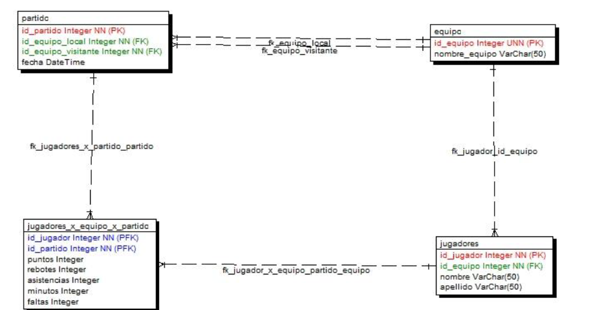

# guia8

1. Generar un Stored Procedure que permite ingresar un equipo.
2. Generar un Stored Procedure que permita agregar un jugador pero se debe pasar el
nombre del equipo y no el Id.
3. Generar un Stored Procedure que permita dar de alta un equipo y sus jugadores.
Devolver en un parámetro output el id del equipo.
4. Generar un Stored Procedure que liste los partidos de un mes y año, pasado por
parametro.
5. Generar un Stored Procedure que devuelva el resultado de un partido pasando por
parámetro los nombres de los equipos. El resultado debe ser devuelto en dos
variables output
6. Generar un stored procedure que muestre las estadisticas promedio de los jugadores
de un equipo.