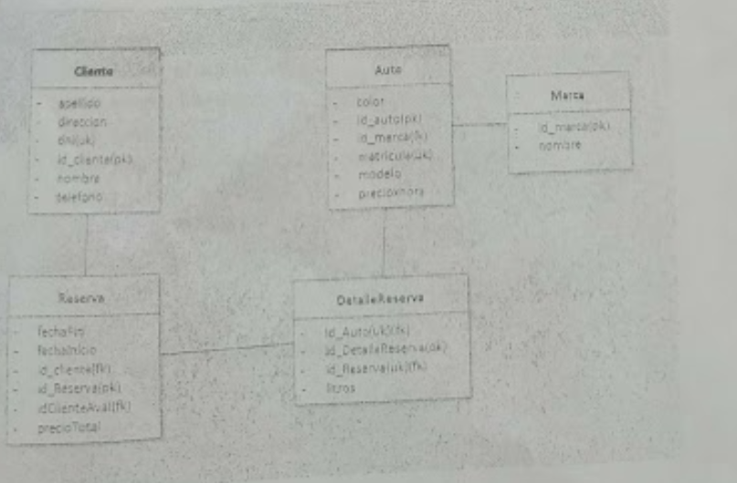

# parcial1

1. Mostrar información de los autos de la marca FIAT y clasificar por categoría (alta, media y baja)
menor a 2000, entre dosmil y cincomil, y mas de cincomil
2. Mostrar el cliente y la cantidad de reservas realizadas con autos de la marca 'Fiat'. Mostrar
únicamente aquellos con mas de cinco reservas realizadas.
3. Mostrar las reservas realizadas en el año 2022 con el siguiente formato, donde "autos" corresponde a la cantidad de autos reservados en dicha reserva. 
4. Crear un Store Procedure que tome por parámetro el DNI de un cliente y devuelva el total abonado por auto.