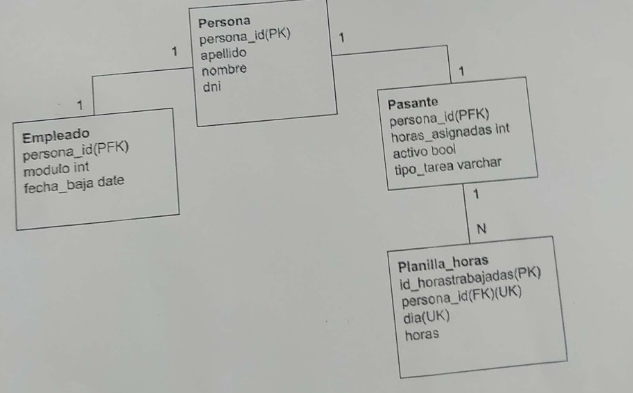

# parcial2

1. Obtener el listado del personal activa (activo o sin fecha de baja) de la empresa con el siguiente formato:

| PERSONAL | TIPO |
| --- | --- |
| Jorge Rojas | Empleado |
| Alberto Plaza | Pasante |
1. Listar apellido y nombre de los pasantes que tienen más horas asignadas que el promedio de todos los pasantes activos
2. Mostrar los tipos de tareas que llevaron mas horas que le promedio de horas realizadas de su mismo tipo

| TIPO TAREA | Horas |
| --- | --- |
| Sistemas | 400 |
| Sonido | 67 |
1. Crear un Store Procedure que reciba por parámetro el DNI de un pasante
y devuelva las horas trabajadas x día.